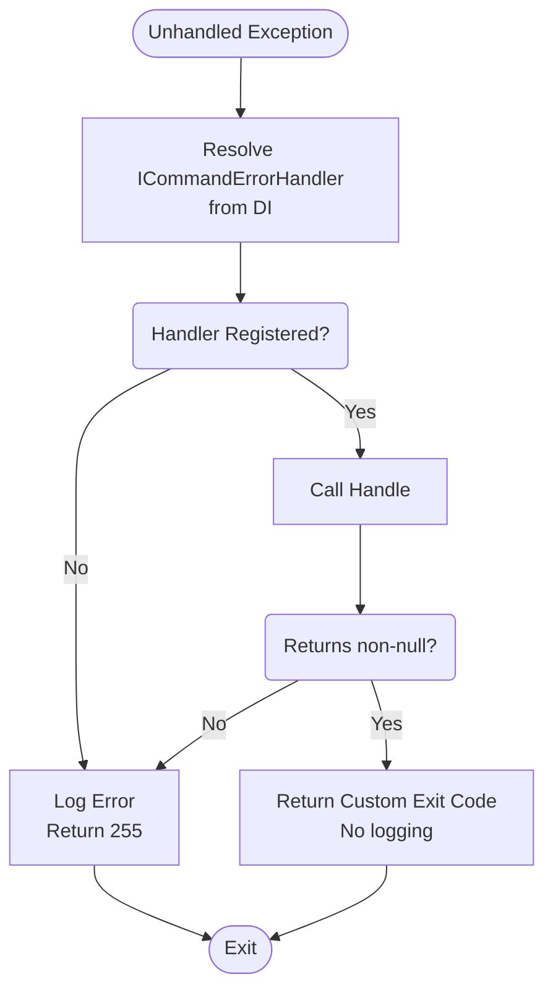

# Custom Global Error Handler

`Albatross.CommandLine` provides the @Albatross.CommandLine.ICommandErrorHandler interface to plug in custom exception handling logic that runs when an unhandled exception escapes a command handler.

## How It Works

When a command handler throws an unhandled exception, the `GlobalCommandAction` catches it and checks whether an `ICommandErrorHandler` is registered in the DI container:

- If a handler is registered and its `Handle` method returns a **non-null** exit code, that exit code is returned and the default error logging is suppressed.
- If no handler is registered, or `Handle` returns **null**, the default behavior applies: the exception is logged at the `Error` level and exit code `255` is returned.



## Interface Definition

```csharp
public interface ICommandErrorHandler {
    /// <summary>
    /// Called when an unhandled exception escapes a command handler.
    /// Return a non-null exit code to suppress default error logging.
    /// Return null to fall through to default behavior.
    /// </summary>
    int? Handle(Exception exception);
}
```

## Implementing a Custom Handler

```csharp
public class MyErrorHandler : ICommandErrorHandler {
    private readonly ILogger<MyErrorHandler> logger;

    public MyErrorHandler(ILogger<MyErrorHandler> logger) {
        this.logger = logger;
    }

    public int? Handle(Exception exception) {
        if (exception is ValidationException validationEx) {
            logger.LogWarning("Validation failed: {message}", validationEx.Message);
            return 2;
        }

        if (exception is UnauthorizedAccessException) {
            logger.LogWarning("Access denied");
            return 3;
        }

        // Return null to fall through to default error logging
        return null;
    }
}
```

## Registration

Register the handler in your DI setup:

```csharp
void RegisterServices(HostBuilderContext ctx, IServiceCollection services) {
    services.AddSingleton<ICommandErrorHandler, MyErrorHandler>();
}

await using var host = new CommandHost("My App")
    .RegisterServices(RegisterServices)
    .AddCommands()
    .Parse(args)
    .Build();
return await host.InvokeAsync();
```

> [!NOTE]
> Only one `ICommandErrorHandler` can be registered. If you need to handle multiple exception types, dispatch within a single implementation.

## Exit Code Conventions

The following exit codes are reserved by `GlobalCommandAction` for its default behaviors:

| Exit Code | Meaning |
|-----------|---------|
| 255 | Unhandled exception (default) |
| 254 | Command cancelled (`OperationCanceledException`) |
| 253 | Input action (option handler) error |

Avoid returning these values from your custom handler to prevent ambiguity.
