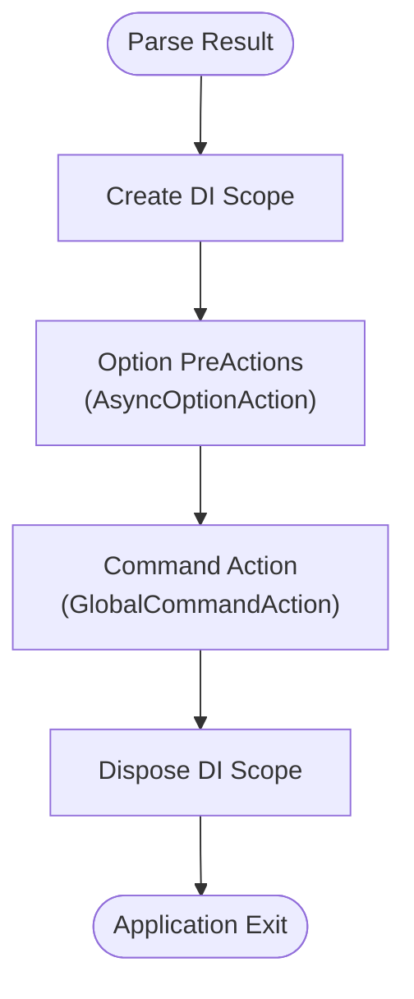
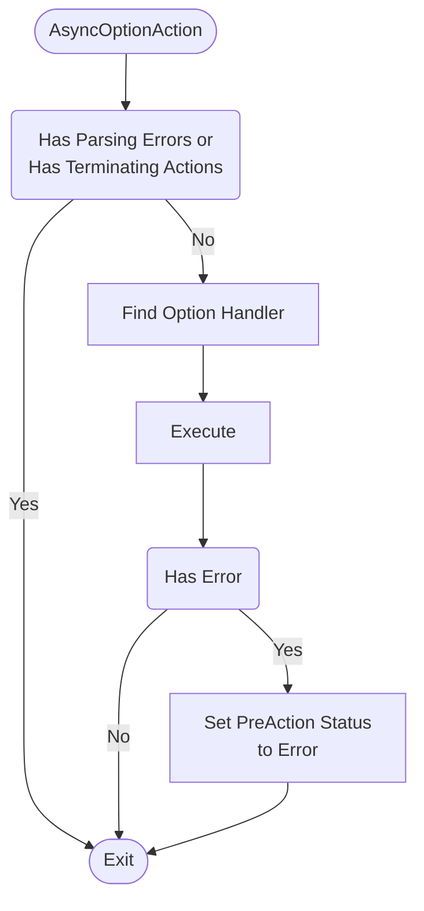
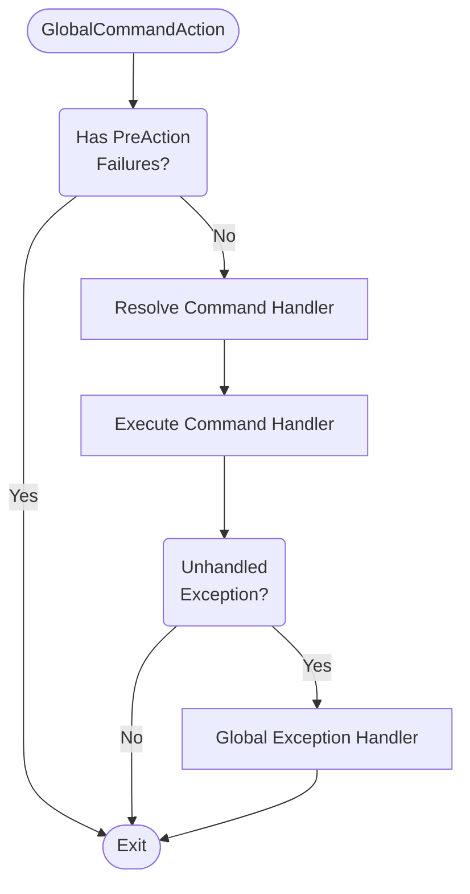

# Execution Pipeline

Understanding the execution pipeline is crucial for developers working with `Albatross.CommandLine`, especially when implementing advanced features like option handlers and custom validation logic.

## System.CommandLine Foundation

The built-in execution pipeline of `System.CommandLine` is composed of:
- **0 or more PreActions** for Options
- **A single Action** for the Command

### Limitations of the Base Pipeline

The standard `System.CommandLine` pipeline has some limitations that `Albatross.CommandLine` addresses:

1. **Static Termination Flag**: A PreAction can short-circuit execution if its `Terminating` property is `true`, but this flag is read **before** execution. Changing it during PreAction execution has no effect.

2. **No Dependency Injection**: Standard actions don't support DI out of the box.

3. **Limited Context Sharing**: No built-in mechanism for sharing state between option handlers and command handlers.

## Albatross.CommandLine Enhanced Pipeline

`Albatross.CommandLine` enhances the execution pipeline by using internal `Actions` that are set directly on Options and Commands:

- **For Options**: [`AsyncOptionAction`](https://github.com/RushuiGuan/commandline/blob/main/Albatross.CommandLine/AsyncOptionAction.cs) - Enables async option handlers with DI
- **For Commands**: [`GlobalCommandAction`](https://github.com/RushuiGuan/commandline/blob/main/Albatross.CommandLine/GlobalCommandAction.cs) - Provides unified command execution with DI and context management

This mechanism enables:
- ✅ **Dependency Injection** throughout the pipeline
- ✅ **Global Exception Handling** with proper logging
- ✅ **Command Context** for state sharing and early termination
- ✅ **Async Support** for both options and commands

## High-Level Execution Flow

## Option Handler Pipeline (AsyncOptionAction)

Each option with an attached handler goes through this pipeline.  Note that **the execution is skipped if there is parsing error or terminating preactions.**

## Command Handler Pipeline (GlobalCommandAction)

The main command execution follows this flow.  **The command action will only execute if there are no parsing errors and it is not short circuited by the preactions.**

## Key Benefits of the Enhanced Pipeline
1. **Dependency Injection Throughout**
Every component in the pipeline has access to the DI container, enabling clean separation of concerns and testability.
2. **Proper Resource Management**
A single DI scope is created per command execution and shared between all option handlers and the command handler, ensuring consistent resource lifecycle and proper cleanup.
3. **Centralized Error Handling**
All exceptions are caught and handled at the appropriate level, with consistent logging and error reporting.
4. **Flexible Control Flow**
Option handlers can terminate execution early, pass data to command handlers, or transform input before the main logic runs.
5. **Context Preservation**
The @Albatross.CommandLine.CommandContext maintains state throughout the pipeline, enabling communication between different stages.